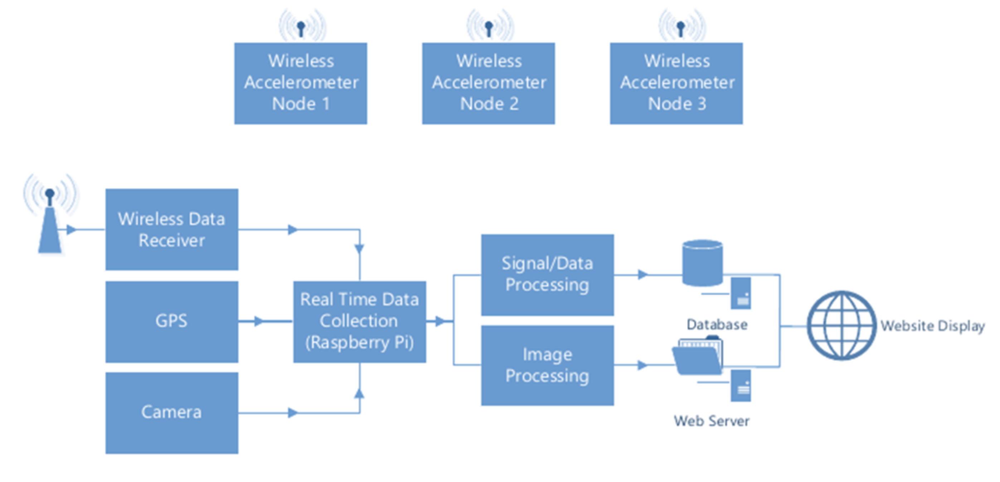
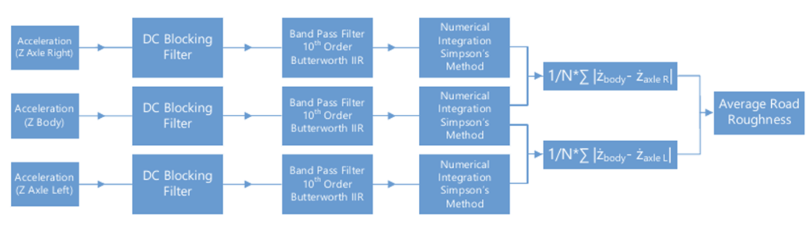
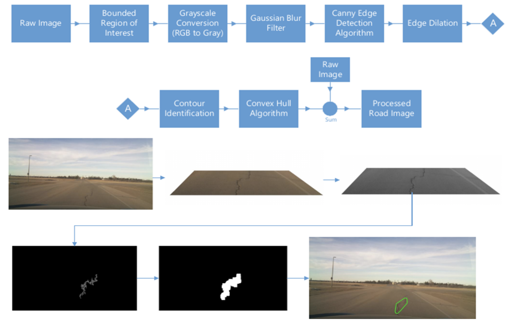
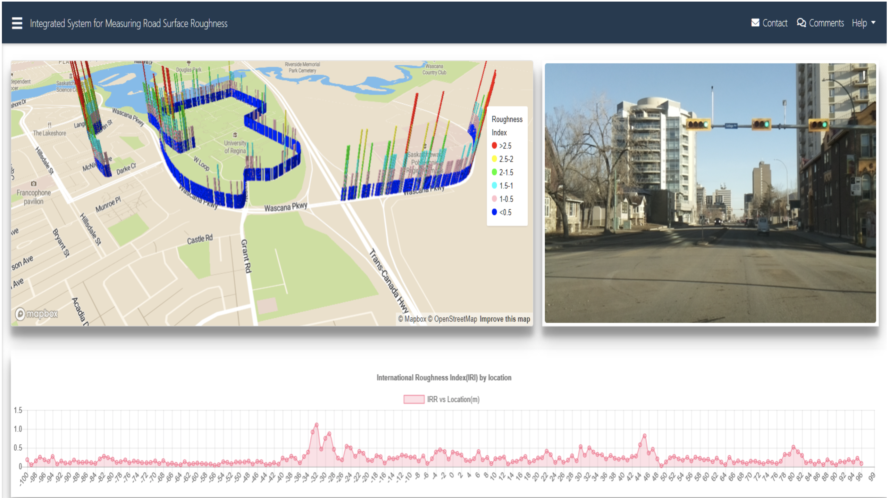

<h3>Road Roughness Measurement System</h3> 
<h4>Introduction</h4>
Road roughness data is expensive and painstaking to gather. A new approach minimizes the overall cost of such systems by building a low cost and modular system that can be used to take measurements of the road roughness and can be used to supplement the more expensive equipment to map all of the roadways. The system supports the measurement of road surface roughness where data is not currently being collected such as smaller rural municipalities roads and residential city roads. The measurement of road roughness along with images that provide visual reference are used to quantify road surface conditions. 

<h4>System Architecture</h4>

The system block diagram shows the architecture to capture, process and display the required. Three independent nodes are used to collect acceleration data from the road. Each node uses a 6-DoF MPU6050 accelerometer connected to a STM32 Cortex M3 microcontroller via I2C. The microcontroller processes the data and sends the data packets to a Xbee transmitter. The system operates in a star network topology using the IEEE 802.15.4 protocol to receive the frames from each node. The receiver is connected to the Raspberry Pi. The Raspberry Pi simultaneously receives position data from a GPS module and road images captured from the camera. The data is processed on the Raspberry Pi and sent to a server to be displayed on a website showing the worst quality roads on a map. 

<h4>Data Processing Pipeline</h4>

Raw acceleration data captured from the accelerometers needs to be processed in order to create a quantifiable measurment of road roughness. Accelerometer data is first passed through a DC blocking filter in order to remove the gravity bias from the measurements. A 10th order bandpass filter is used to remove noise from the measurments and data is then integrated to calculate velocity. An algorithm is then used to compute vertical displacement in m/m, which provides the required road roughness value.   

<h4>Image Processing Pipeline</h4>

Images are captured of the road surface in order to provide data regarding potholes and cracks in the road surface. 

Raw images are processed in order to provide an indication of the degradation of the road surface. The edge detection algorithm is used after passing the image through a gaussian blur filter. The edge is dilated and a convex hull algorithm is used to draw an approximate outline around the cracks or potholes in the road surface. The size of the convex polygon indicates the severity of the degradation in the road surface.    

<h4>Results</h4>

The data captured and processed from the system descibed above was display on a website to show the roughest parts of the roads in the city. 

<h6>Notes</h6>
See attached report and paper under the document folder to see further details regarding the software/hardware implementation, testing and challenges encountered.
